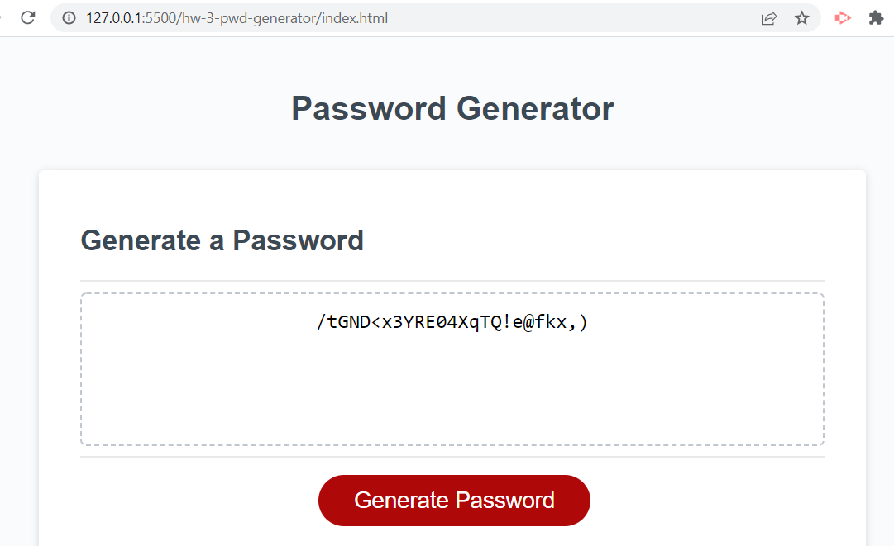

# Password Generator

## Description

The purpose of this web site is to create a password generator. This generator will create a password based on the user selecting what criteria to include:

- Lowercase
- Uppercase
- Numbers
- Special characters
- Password length

The page uses javascript to capture the criteria, calculate the password, and then display it on the page.

## Table of Contents

- [Screenshots and Links](#screenshots)
- [Acceptance Criteria](#acceptance)
- [What I Learned](#learned)

## ScreenShots
Below is a screen shot of the page after generating a password:

The page is live on  [GitHub Pages](https://stephencurrie.github.io/hw-3-pwd-generator/)

The code is in the  [GitHub Repository](https://github.com/stephencurrie/hw-3-pwd-generator)

## Acceptance

The following were the acceptance criteria for the ticket:

- [x] When I click the button to generate a password, I am presented a series of prompts asking for password criteria
- [x] When I am presented the prompts, I select the password criteria to include in the password
- [x] When presented the password length, I select the length of the password between 8 and 128 characters
- [x] When asked for the character type, I am presented with options for the following: lowercase, uppercase, numbers, and special characters
- [x] My choices are validated and at least one option should be chosen
- [x] The password is generated and the displayed on the html page

## Learned

The following is a list of things I learned:
- How to use windows alerts to capture input from the user
- How to concatenate and push arrays to build them
- How to use for loops to cycle through an array
- How to Math.random and Math.floor to randomize an element in an array
- How to use query selectors to display javascript output to an html page